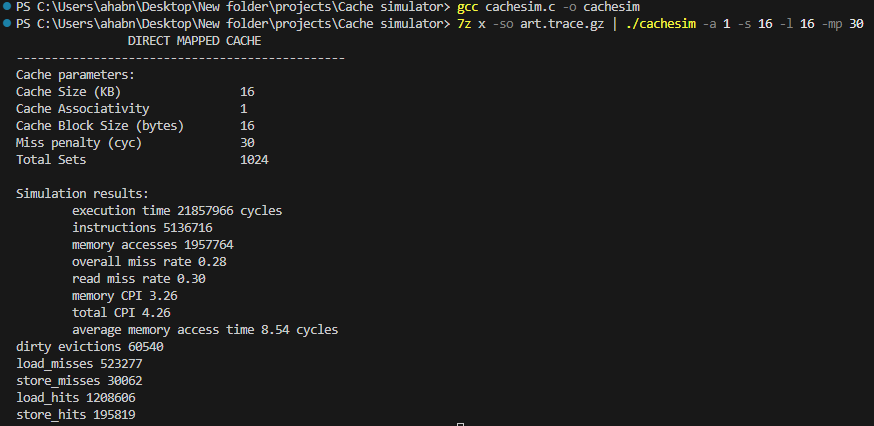
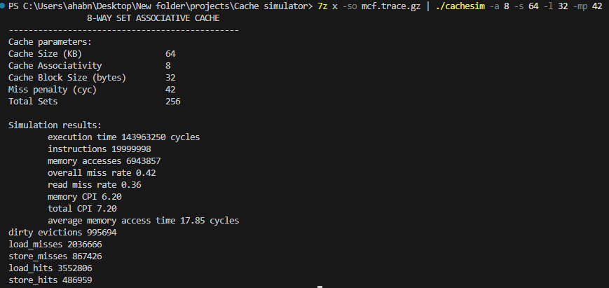

# A TRACE-BASED CACHE SIMULATOR FOR ALL CACHE TYPES

This is a project from this [website](https://occs.oberlin.edu/~ctaylor/classes/210SP13/cache.html) to help users of the site understand the functionings of the cache

## TABLE OF CONTENTS
- [Overview](#overview)
- [Screenshot](#screenshot)
- [My process](#process)
  - [Built with](#built_with)
  - [What i learnt](#what_i_learnt)
  - [Compilation instructions](#compilation_instruction)
- [Author](#author)
- [Acknowledgement](#acknowledgement)

## OVERVIEW
There are two types of cache simulators,  *An execution-driven cache simulator* and *A trace-based cache simulator*. An execution driven cache is a simulator that works on the memory accesses from a program running on a computer as compared to a trace based cache that uses address-traces(memory addresses stored into a file) for running simulations

This project is a built trace-based Write-allocate, Write-back cache simulator that can simulate all types of caches being fully associative caches, direct mapped caches, and set associative caches

The content of the trace file should be in this format
 ```
     # LOADSTORE ADDRESS ICOUNT
```

with # being the marker, loadstore == 0 being a load instruction and loadstore == 1 being a store instruction, and icount being the no of previous instructions including the address itself

## SCREENSHOTS
- Example 1;


- Example 2;


## MY PROCESS

Brainstorming before creating the project led to me comming up with three main Scenarios for both load and store instructions
1. When the tags from the address match the tags in a way and the valid bit of that way is set (LOAD HIT OCCURS)

2. When the tag from the address does not match the tag in any way of a set, and all the ways are filled with valid data (LOAD MISS, DIRTY EVICTIONS HAPPEN)

3. When the tag from the address does not match the tag in any way of a set, and all the ways are not filled with valid data (LOAD MISS, NO DIRTY EVICTIONS HAPPEN )

Coming up with these scenarios, the whole process became easier to implement in the C programming language, 

### BUILT WITH
    - The entire code is built with simpe C language syntaxes


### COMPILATION INSTRUCTION
To run the code, 
- First download this repo
- Then in your terminal run the code to compile the c file
```
  gcc cachesim.c -o cachesim
```
- If you have gunzip installed run the code below to get the parameters 
``` 
  gunzip -c art.trace.gz |  ./cachesim -a 1 -s 16 -l 16 -mp 30
```
- If you have 7zip installed run the code below to get the parameters 
``` 
  7z x -so art.trace.gz |  ./cachesim -a 1 -s 16 -l 16 -mp 30
```

The flags and their meaning
-  -l (Block size in bytes)
-  -s (Cache size in kilobytes)
-  -a (Associativity)
-  -mp (miss penalty)
  
## ACKNOWLEDGEMENT
- [https://coffeebeforearch.github.io/2020/12/16/cache-simulator.html](https://coffeebeforearch.github.io/2020/12/16/cache-simulator.html)


